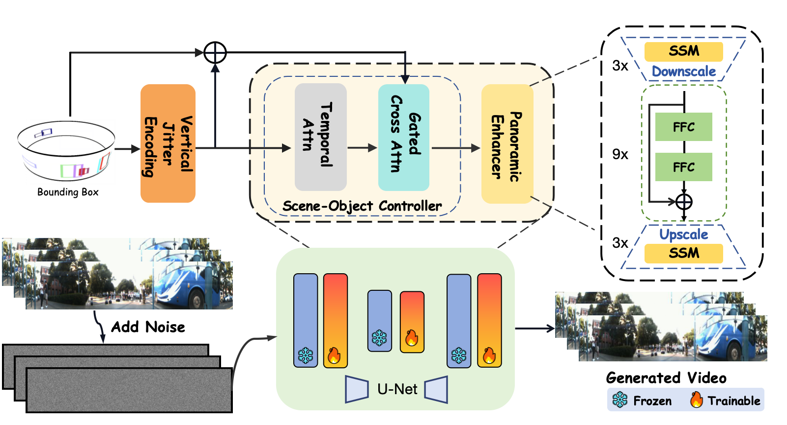

<p align="center">

  <h1 align="center">QuaDreamer: Controllable Panoramic Video Generation for Quadruped Robots</h1>
  <h3 align="center">CoRL 2025</h3>


  <p align="center">
    <a href="https://github.com/losehu"><strong>Sheng Wu</strong></a>
    ·
    <a href="https://github.com/Bryant-Teng"><strong>Fei Teng</strong></a>
    ·
    <a href="https://scholar.google.com/citations?hl=zh-CN&user=0EI9msQAAAAJ"><strong>Hao Shi</strong></a>
    ·
    <a href="https://github.com/zju-jiangqi"><strong>Qi Jiang</strong></a>
    ·
    <a href="https://github.com/xifen523"><strong>Kai Luo</strong></a>
    ·
    <a href="https://scholar.google.com/citations?hl=zh-CN&user=B6xWNvgAAAAJ"><strong>Kaiwei Wang</strong></a>
    ·
    <a href="https://scholar.google.com/citations?hl=zh-CN&user=pKFqWhgAAAAJ"><strong>Kailun Yang</strong></a>
</p>

[](https://arxiv.org/abs/2508.02512)
<a href="https://pytorch.org/get-started/locally/"></a> 
<h2 align="center"></h2>


**QuaDreamer** Panoramic cameras, capturing comprehensive 360-degree environmental data, are suitable for quadruped robots in surrounding perception and interaction with complex environments. However, the scarcity of high-quality panoramic training data — caused by inherent kinematic constraints and complex sensor calibration challenges — fundamentally limits the development of robust perception systems tailored to these embodied platforms. To address this issue, we propose QuaDreamer—the first panoramic data generation engine specifically designed for quadruped robots. QuaDreamer focuses on mimicking the motion paradigm of quadruped robots to generate highly controllable, realistic panoramic videos, providing a data source for downstream tasks. Specifically, to effectively capture the unique vertical vibration characteristics exhibited during quadruped locomotion, we introduce Vertical Jitter Encoding (VJE). VJE extracts controllable vertical signals through frequency-domain feature filtering and provides high-quality prompts. To facilitate high-quality panoramic video generation under jitter signal control, we propose a Scene-Object Controller (SOC) that effectively manages object motion and boosts background jitter control through the attention mechanism. To address panoramic distortions in wide-FoV video generation, we propose the Panoramic Enhancer (PE) – a dual-stream architecture that synergizes frequency-texture refinement for local detail enhancement with spatial-structure correction for global geometric consistency. We further demonstrate that the generated video sequences can serve as training data for the quadruped robot's panoramic visual perception model, enhancing the performance of multi-object tracking in 360-degree scenes.

# Model framework


<div align="center">




</div>

# TODO
- [✅] Release the [arxiv preprint](https://arxiv.org/pdf/2508.02512).
- [✅] Publish training and evaluation code.
- [❌] Publish Training dataset
- [❌] Add training and evaluation instructions


<br>


# Acknowledgement
Our model is based on [Trackdiffusion-SVD](https://github.com/pixeli99/TrackDiffusion/tree/SVD) , [CameraCtrl](https://github.com/hehao13/CameraCtrl) , [ObjCtrl-2.5D](https://github.com/wzhouxiff/ObjCtrl-2.5D) , [ZITS_inpainting](https://github.com/DQiaole/ZITS_inpainting) . Thanks for their great work!


# Citation
If our work is helpful to you, please consider citing us by using the following BibTeX entry:
```
@article{wu2025quadreamer,
  title={QuaDreamer: Controllable Panoramic Video Generation for Quadruped Robots},
  author={Wu, Sheng and Teng, Fei and Shi, Hao and Jiang, Qi and Luo, Kai and Wang, Kaiwei and Yang, Kailun},
  journal={arXiv preprint arXiv:2508.02512},
  year={2025}
}
```